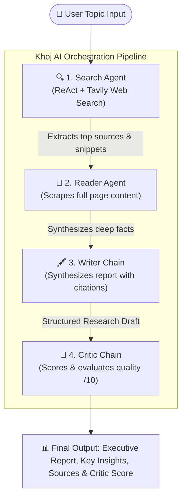

<div align="center">

# 🪔 Khoj AI (खोज)
### *Autonomous Multi-Agent Deep Research & Intelligence System*

[](https://python.org)
[](https://langchain.com)
[](https://langchain-ai.github.io/langgraph/)
[](https://groq.com)
[](https://streamlit.io)
[](LICENSE)

<p align="center">
  <b>An end-to-end autonomous research pipeline powered by coordinated ReAct AI agents.</b><br>
  Khoj AI conducts web searches, scrapes deep technical content, drafts structured research papers, and performs critical quality scoring in seconds.
</p>

[Key Features](#-key-features) •
[Architecture](#-architecture) •
[Agent Roles](#-the-4-specialized-agents) •
[Quick Start](#-quick-start) •
[Project Structure](#-project-structure) •
[Tech Stack](#-tech-stack)

</div>

---

## 🌟 Key Features

- **⚡ Sub-25s Autonomous Research**: End-to-end multi-agent orchestration running at ultra-high inference speeds on Groq LPUs.
- **🤖 4-Stage Coordinated Multi-Agent Architecture**: ReAct agents search, read, write, and critique sequentially using LangGraph and LangChain.
- **🌐 Real-Time Live Web Intelligence**: Integrated with Tavily AI Search API for up-to-the-minute web retrieval and BeautifulSoup/Tavily Extract for in-depth page scraping.
- **🛡️ Fault-Tolerant Resilient Execution**: Built-in schema normalization, rate-limit buffers, and automatic fallbacks to handle API rate limits and model variances seamlessly.
- **🎨 Glassmorphic Premium Interface**: Modern, responsive dark-mode UI with live animated agent progress rails, collapsible output inspectors, and one-click Markdown downloads.
- **💻 Dual Interface**: Run interactively via the Streamlit web dashboard or headlessly via the terminal CLI pipeline.

---

## 🏛️ Architecture



---

## 👥 The 4 Specialized Agents

| # | Agent / Chain | Role | Tools / Engine | Output |
|---|---------------|------|----------------|--------|
| **01** | **Search Agent** | Autonomous ReAct agent querying the web for high-credibility, recent sources. | `search`, `web_search` (Tavily AI API) | Curated source URLs, titles, and key summaries |
| **02** | **Reader Agent** | Deep extraction agent that crawls and scrapes the most authoritative URL. | `scrape_url`, `scrape` (Tavily Extract + BeautifulSoup) | Clean, parsed page insights without ads or clutter |
| **03** | **Writer Chain** | Synthesis chain organizing complex raw data into a publication-ready report. | Few-shot Prompt Engineering + LLM | Executive Summary, Key Findings, Implications, Sources |
| **04** | **Critic Chain** | Rigorous evaluation chain acting as a peer reviewer. | Heuristic Rubric + LLM Evaluation | 1-10 Quality Score, Strengths, Gaps & Recommendations |

---

## 🚀 Quick Start

### 1. Clone the Repository
```bash
git clone https://github.com/your-username/Multi-agent-research-system.git
cd Multi-agent-research-system
```

### 2. Create a Virtual Environment
```bash
# Windows
python -m venv venv
venv\Scripts\activate

# macOS / Linux
python3 -m venv venv
source venv/bin/activate
```

### 3. Install Dependencies
```bash
pip install -r requirements.txt
```

### 4. Configure Environment Variables
Create a `.env` file in the root directory:
```env
GROQ_API_KEY="your_groq_api_key_here"
TAVILY_API_KEY="your_tavily_api_key_here"
GROQ_MODEL="llama-3.3-70b-versatile"
```
> **Get Free API Keys:**
> - [Groq Console](https://console.groq.com) (Ultra-fast LLM inference)
> - [Tavily AI](https://tavily.com) (Search engine built for AI agents)

---

## 🖥️ Usage

### Option A: Launch Web Dashboard (Streamlit)
```bash
streamlit run app.py
```
Open your browser at `http://localhost:8501`. Enter any research topic (e.g., *"Quantum computing breakthroughs in 2025"* or *"CRISPR clinical trials"*) and click **Start Research**.

### Option B: Run via Terminal CLI
```bash
python pipeline.py
```
Type your research query at the prompt and watch the four agents log progress directly in your console.

---

## 📁 Project Structure

```
Multi-agent-research-system/
├── app.py              # Streamlit Web UI with glassmorphic styling & reactive progress
├── agents.py           # Multi-agent definitions (Search, Reader, Writer, Critic)
├── tools.py            # Custom LangChain tools (Tavily search, web scraping, URL fallback)
├── pipeline.py         # Standalone CLI orchestration pipeline
├── requirements.txt    # Production dependency requirements
├── .env                # Environment secrets (API keys & models)
├── .gitignore          # Git exclusion rules
└── README.md           # Project documentation
```

---

## 🛠️ Tech Stack

- **Frameworks & Orchestration**: [LangChain](https://github.com/langchain-ai/langchain), [LangGraph](https://github.com/langchain-ai/langgraph) (ReAct Agent architecture)
- **Inference Engine**: [Groq Cloud](https://groq.com/) LPUs (`llama-3.3-70b-versatile` & `llama-3.1-8b-instant`)
- **Search & Retrieval**: [Tavily AI Search API](https://tavily.com/)
- **Web Crawling & Parsing**: [BeautifulSoup4](https://www.crummy.com/software/BeautifulSoup/), Requests, Tavily Extract
- **Frontend Dashboard**: [Streamlit](https://streamlit.io/) with custom responsive CSS
- **Logging & CLI Formatting**: [Rich](https://github.com/Textualize/rich)

---

## 🛡️ Resilience & Engineering Highlights

1. **ReAct Tool-Calling Normalization**: Supports native tool aliases (`search` / `web_search` and `scrape` / `scrape_url`) to eliminate schema mismatches across diverse foundation models.
2. **Dynamic URL Discovery & Fallback**: Stores discovered URLs in an in-memory session stack; if a scraping agent omits a target URL, it automatically resolves to the highest-ranking search hit.
3. **Token Budget Optimization**: Intelligently truncates raw HTML / search noise to stay well within Groq's Tokens-Per-Minute (TPM) limits without sacrificing report depth.
4. **Graceful Failover Shield**: Automatically catches API rate limit spikes and switches between models without crashing user sessions.

---

## 📄 License

This project is licensed under the **MIT License** — see the [LICENSE](LICENSE) file for details.
